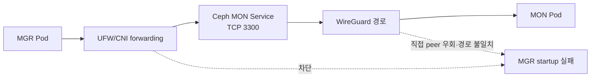
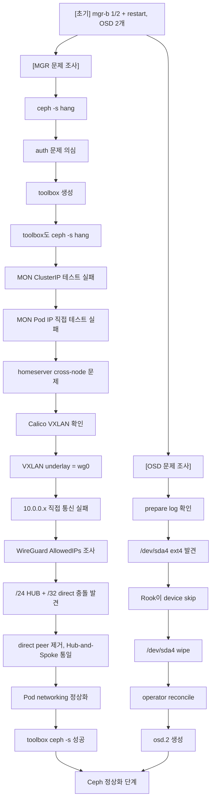

# Rook-Ceph 구축 장애 및 트러블슈팅

Rook-Ceph 구축 과정에서 겪었던 주요 장애(네트워크 및 OSD 프로비저닝 문제)와 해결 과정을 정리한 문서입니다.

---

## 1. MGR CrashLoopBackOff 및 Ceph 네트워크 장애

> **결론:** Rook-Ceph MGR의 `CrashLoopBackOff`는 단일 Pod 문제가 아니었습니다. 
**UFW가 Pod → Ceph MON Service TCP 3300 traffic을 차단**했고, 
WireGuard leaf 설정에 직접 **peer와 hub peer가 혼재해 의도한 중앙 집중형 경로가 보장되지 않았습니다.** UFW forwarding 허용과 WireGuard 허브-스포크 정렬 후 통신 경로를 일관되게 만들었습니다.

### 증상

Rook-Ceph MGR Pod가 다음 상태를 반복했습니다.

```text
READY     1/2
STATUS    Running (또는 CrashLoopBackOff)
RESTARTS  증가
```

Pod의 `watch-active` 컨테이너는 실행됐지만, 실제 `mgr` 컨테이너가 startup probe를 통과하지 못했습니다. 이벤트에는 다음 메시지가 보였습니다.

```text
ceph daemon health check failed
admin_socket: ... No such file or directory
```

이 메시지는 MGR daemon이 정상 초기화되지 않아 admin socket을 만들지 못했다는 결과로 해석했습니다.

### 조사 과정

#### 1. MON 상태 확인

MON Pod 3개는 모두 `Running` 상태였습니다. `CephCluster`도 `Ready`로 전환됐지만, MGR은 MON endpoint에 접속해야 정상적으로 시작할 수 있으므로 Pod 상태만으로 네트워크 정상 여부를 판단할 수 없었습니다.

#### 2. UFW 차단 로그 확인

커널 로그에서 MGR Pod가 Ceph MON Service의 TCP 3300으로 보내는 SYN 패킷이 차단된 것을 확인했습니다.

```text
SRC=<mgr-pod-ip>
DST=<ceph-mon-service-ip>
DPT=3300
[UFW BLOCK]
```

처음에는 Pod CIDR → Pod CIDR만 허용했지만, 실제 MGR의 목적지는 Kubernetes Service CIDR의 MON endpoint였습니다. 따라서 Pod CIDR → Service CIDR의 forwarding 규칙도 필요했습니다.

#### 3. WireGuard peer 선택 확인

leaf 노드 설정에는 일부 leaf를 향한 직접 `/32` peer와, 허브를 향한 `10.0.0.0/24` peer가 함께 존재했습니다. `/32`가 `/24`보다 구체적이므로 해당 목적지 트래픽은 허브 대신 직접 peer로 전송될 수 있었습니다.

이 환경은 모든 VPN 트래픽을 허브 `10.0.0.8`을 경유하도록 설계했으므로, 실제 라우팅 방식과 설계가 불일치했습니다.



### 조치

#### 1. UFW: Pod → Service 경로 허용

각 Kubernetes 노드에서 실제 Pod CIDR와 Service CIDR에 맞춰 Ceph MON 포트를 forwarded 백엔드 트래픽으로 허용했습니다.

```bash
sudo ufw route allow proto tcp \
  from <POD_CIDR> to <SERVICE_CIDR> port 3300

sudo ufw route allow proto tcp \
  from <POD_CIDR> to <SERVICE_CIDR> port 6789
```

OSD를 배치한 뒤에는 Ceph OSD/MDS의 기본 포트 범위도 필요한 범위에서 별도로 허용합니다.

```bash
sudo ufw route allow proto tcp \
  from <POD_CIDR> to <POD_CIDR> port 6800:7568
```

#### 2. WireGuard: 허브-스포크 구조로 통일

leaf 노드에서는 직접 leaf peer 설정을 제거하고, hub peer만 유지했습니다. hub peer의 `AllowedIPs`는 VPN 대역 전체로 설정해 모든 VPN 목적지가 허브를 다음 hop으로 선택하게 했습니다.

```ini
[Peer]
PublicKey = <hub-public-key>
AllowedIPs = 10.0.0.0/24
Endpoint = <hub-public-endpoint>:51820
PersistentKeepalive = 25
```

허브는 각 leaf의 VPN IP를 `/32` peer로 유지하고 IP forwarding 및 UFW forwarding을 허용합니다.

#### 3. MGR 재기동 및 검증

네트워크 규칙을 반영한 뒤 MGR Pod를 재생성하고 다음 상태를 확인합니다.

```bash
kubectl -n rook-ceph delete pod <mgr-pod>
kubectl -n rook-ceph get pods -l app=rook-ceph-mgr -w
```

정상 목표:

```text
rook-ceph-mgr-...   2/2   Running
```

추가로 `ceph status`, `ceph health detail`, MON quorum 상태를 확인합니다.

---

## 2. OSD 노드 프로비저닝 실패 (Ext4 Signature 문제)

### 증상

네트워크 문제를 해결한 후에도 Ceph 상태에 다음 경고가 지속되었습니다.

```text
cluster:
  health: HEALTH_WARN
          OSD count 2 < osd_pool_default_size 3

services:
  osd: 2 osds: 2 up, 2 in
```

클러스터는 기본 replica size가 3으로 설정되어 있었으나 OSD가 2개만 존재하여 발생한 문제였습니다. 당시 OSD 노드 배치는 다음과 같았습니다.

```text
root default
├─ openstack-jw-02
│   └─ osd.1  nvme
│
└─ yongwan-server
    └─ osd.0  hdd
```

`homeserver2` 노드에 설정한 `/dev/sda4` 장치가 누락된 상태였습니다.

### 원인 분석

`homeserver2`의 OSD를 생성하는 `rook-ceph-osd-prepare-homeserver2` 파드 로그를 확인한 결과, Rook 설정에는 대상 장치가 올바르게 지정되어 있었습니다.

```text
desired devices:
/dev/sda4
```

하지만 Rook 인벤토리에서 해당 디바이스 정보를 조회해 보니 기존에 사용했던 파일시스템 흔적이 남아 있었습니다.

```text
NAME=/dev/sda4
FSTYPE=ext4
SIZE≈125GB
```

이로 인해 Rook은 데이터 보호를 위해 디바이스 사용을 스킵했습니다.

```text
skipping device "sda4" because it contains a filesystem "ext4"
...
0 ceph-volume lvm osd devices configured
0 ceph-volume raw osd devices configured
skipping OSD configuration as no devices matched
```

즉, **Ceph 네트워크와는 무관한 별도의 스토리지 프로비저닝(파일시스템 시그니처 잔존) 문제**였습니다.

### 조치 및 결과

1. **디바이스 초기화**: `homeserver2`의 `/dev/sda4`에 남아있는 `ext4` 파일시스템 시그니처를 완전히 제거(wipe)했습니다.
2. **이전 작업 삭제**: 실패했던 Prepare Job을 삭제했습니다.
   ```bash
   kubectl -n rook-ceph delete job rook-ceph-osd-prepare-homeserver2-...
   ```
3. **Operator 재시작**: Rook Operator를 재시작하여 새로운 상태를 감지(Reconcile)하도록 유도했습니다.
   ```bash
   kubectl -n rook-ceph delete pod -l app=rook-ceph-operator
   ```

**검증 결과:**
새로운 Prepare Job이 `Completed`로 끝나고, OSD 파드가 정상적으로 생성되었습니다.

```text
rook-ceph-osd-prepare-homeserver2-swld7   0/1 Completed
rook-ceph-osd-2-68987bdb58-kpdgk          1/1 Running
```

---

## 3. 최종 상태 점검

네트워크 장애와 스토리지 장애를 모두 해결한 후, Toolbox에서 최종 상태를 검증합니다.

```bash
kubectl -n rook-ceph exec deploy/rook-ceph-tools -- ceph -s
```

```text
health: HEALTH_OK

mon: 3 daemons, quorum a,b,d
mgr: a(active), standbys: b
osd: 3 osds: 3 up, 3 in
```

```bash
kubectl -n rook-ceph exec deploy/rook-ceph-tools -- ceph osd tree
```

```text
root default
├─ host openstack-jw-02
│  └─ osd.1  up
├─ host yongwan-server
│  └─ osd.0  up
└─ host homeserver2
   └─ osd.2  up
```

---

## 4. 장애 처리 전체 흐름도

이번에 겪은 복합 장애(네트워크 + 스토리지)의 전체 트러블슈팅 흐름입니다.



---

**주요 교훈 (Lessons Learned)**

> **결론:** Rook-Ceph MGR의 `CrashLoopBackOff`는 단일 Pod 문제가 아니었습니다. 
> UFW가 Pod → Ceph MON Service TCP 3300 traffic을 차단했고, WireGuard leaf 설정에 직접 peer와 hub peer가 혼재해 의도한 중앙 집중형 경로가 보장되지 않았습니다. UFW forwarding 허용과 WireGuard 허브-스포크 정렬 후 통신 경로를 일관되게 만들 수 있었습니다.

> **Kubernetes에서 Pod 네트워크가 이상하면 Ceph부터 의심하지 말고, Service → Pod IP → CNI route → overlay(VXLAN) → underlay(WireGuard) 순으로 한 단계씩 내려가며 검증해야 합니다.**
> 
> 특히 WireGuard `latest handshake`가 살아 있다고 해서 실제 tunnel IP routing까지 정상이라는 보장은 없습니다. `AllowedIPs`가 routing table 역할을 하기 때문에 Hub-and-Spoke와 direct peer를 섞으면 `/32`가 `/24`를 가로채면서 아주 조용하게 blackhole을 만들 수 있습니다.
